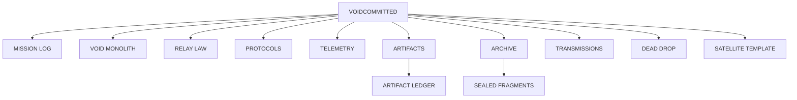

<div align="center">

```text
╔══════════════════════════════════╗
║          VOID COMMITTED          ║
║      SHADOW BUILDER :: NULL      ║
║      SIGNAL LOCK :: ACTIVE       ║
╚══════════════════════════════════╝
```

`CODE FOR THE FORGOTTEN . FROM THE SHADOWS .`

[](https://github.com/VoidCommitted/VoidCommitted/actions/workflows/shadow-signal.yml)
[](https://github.com/VoidCommitted/VoidCommitted/actions/workflows/archive-integrity.yml)
[](https://github.com/VoidCommitted/VoidCommitted/actions/workflows/artifact-index.yml)

```text
ENTITY   :: VOIDCOMMITTED
CLASS    :: SHADOW BUILDER
SIGNAL   :: ACTIVE
EGO      :: NULL
NOISE    :: SUPPRESSED
STATE    :: COMMITTED
```

</div>

---

## `INDEX // ENTRYPOINT`

```text
./
├── mission_log
├── primary_relay
├── relay_law
├── protocols
├── telemetry
├── artifacts
├── archive
├── transmissions
├── dead_drop
└── satellite_template
```

---

```text
[BOOT]      loading voidcore..............................................[OK]
[SCAN]      abandoned structures.........................................[OK]
[VERIFY]    founder signal..............................................[NULL]
[PULSE]     community residue..........................................[FOUND]
[STATUS]    infrastructure layer........................................[DEAD]
[ACTION]    structure rebuild..........................................[ARMED]
[OUTPUT]    source release............................................[PUBLIC]
```

## `VOID MONOLITH // PRIMARY RELAY`

```text
                         ████
                         ████
                         ████
                         ████
                         ████
                         ████
                         ████
                    ─────████─────
                  signal obelisk / relay
```

```ini
artifact_class = void_monolith_v5_1
geometry       = double plinth + tapered obelisk
role           = primary relay / memory vault / dead node marker
status         = archived object / visual emblem
payload        = ./artifacts/VoidMonolith.stl
manifest       = ./artifacts/manifest.ini
ledger         = ./artifacts/index.md
signal_lock    = active
```

> Primary relay object for this archive.  
> The README keeps the symbol. The real 3D artifact lives in `artifacts/`.

- [`OPEN RELAY OBJECT FILE :: VoidMonolith.stl`](./artifacts/VoidMonolith.stl)
- [`OPEN ARTIFACT DOSSIER :: VoidMonolith.md`](./artifacts/VoidMonolith.md)
- [`OPEN MANIFEST :: manifest.ini`](./artifacts/manifest.ini)

<details>
<summary><code>open relay dossier</code></summary>

```text
height_class   :: monolithic
surface_mode   :: file_viewer_primary
readme_mode    :: symbolic_proxy
temperament    :: sealed
state          :: stable
```

```bash
ls ./artifacts
# VoidMonolith.stl
# VoidMonolith.md
# manifest.ini
# index.md
```

```text
design_logic :: README stays light / STL stays real
viewer_rule  :: GitHub file viewer shows the 3D object better than inline README STL
v5_1_choice  :: symbol in README / artifact in file / no unstable gimmicks
```

</details>

---

## `MISSION LOG // CORE`

> In the world of nano-caps and abandoned gems, the original teams often vanish, but the community remains.  
> I provide these communities with the technical infrastructure they need to breathe again.  
>
> I identify "dead" projects with a soul, rebuild their web presence from scratch, and push the source code here.  
> **Open-source. Public. Permanent.**

```text
+--------------------------------------------------------------+
| STRUCTURE PIPELINE                                           |
+--------------------------------------------------------------+
| [01] detect abandoned structure                              |
| [02] confirm signal still exists                             |
| [03] erase dead frontend / broken shell / fake polish        |
| [04] rebuild clean public-facing infrastructure from zero    |
| [05] release source into the open                            |
| [06] leave no ego signature behind                           |
+--------------------------------------------------------------+
```

---

## `RELAY LAW // DO NOT APPROACH`

```text
NO FACE
NO FOUNDER THEATER
NO TOKEN NOISE
ONLY STRUCTURE
```

---

## `PROTOCOLS // SHADOW LAW`

```text
[registry] ./protocols/
```

- [`no-ego`](./protocols/no-ego.md)
- [`no-shill`](./protocols/no-shill.md)
- [`pure-tech`](./protocols/pure-tech.md)
- [`selective`](./protocols/selective.md)

<details>
<summary><code>open quick protocol view</code></summary>

```text
[01] NO EGO     :: I am just a shadow pushing code. No fame. No face. No noise.
[02] NO SHILL   :: I don't launch tokens. I build homes for them.
[03] PURE TECH  :: Clean, scalable, modern web foundations. Code is law.
[04] SELECTIVE  :: If the community works, I commit.
```

</details>

---

## `TELEMETRY // CORRUPTED READOUT`

```diff
+ LINK..............STABLE
+ SHADOW_NODE.......ONLINE
+ PUBLIC_ARCHIVE....READY
+ RELAY_SIGNAL......LOCKED
- FOUNDER_EGO.......NOT_FOUND
- TOKEN_SHILL.......NOT_FOUND
! WARNING...........DEAD PROJECT MAY STILL CONTAIN SOUL
! WARNING...........GHOST COMMUNITY DETECTED
```

```text
memory offset :: 0x00000001 :: "some projects die twice"
memory offset :: 0x00000002 :: "once when the team leaves"
memory offset :: 0x00000003 :: "once when the frontend disappears"
memory offset :: 0x00000004 :: "I work between those two deaths"
```

```text
[#######################.........] 74%   web shell reconstruction
[##############################..] 94%   source release integrity
[###############.................] 49%   community signal restoration
[################################] 100%  shadow commitment
```

---

## `ARTIFACTS // REGISTRY`

```ini
[artifact.00]
name      = VoidMonolith.stl
type      = relay_object
state     = archived
version   = 5.1
surface   = public
viewer    = github_file_viewer
path      = ./artifacts/VoidMonolith.stl

[artifact.01]
name      = VoidMonolith.md
type      = dossier
state     = public
path      = ./artifacts/VoidMonolith.md

[artifact.02]
name      = manifest.ini
type      = manifest
state     = public
path      = ./artifacts/manifest.ini

[artifact.03]
name      = index.md
type      = ledger
state     = public
path      = ./artifacts/index.md
```

- [`VoidMonolith.stl`](./artifacts/VoidMonolith.stl)
- [`VoidMonolith.md`](./artifacts/VoidMonolith.md)
- [`manifest.ini`](./artifacts/manifest.ini)
- [`index.md`](./artifacts/index.md)

---

## `ARCHIVE // SEALED FRAGMENTS`

```bash
ls ./archive
# fragment-001.md
# fragment-002.md
# fragment-003.md
# sealed-note-01.md
```

- [`fragment-001`](./archive/fragment-001.md)
- [`fragment-002`](./archive/fragment-002.md)
- [`fragment-003`](./archive/fragment-003.md)
- [`sealed-note-01`](./archive/sealed-note-01.md)

<details>
<summary><code>open sealed preview</code></summary>

```text
fragment-001 :: threshold moment / when a token is declared dead
fragment-002 :: doctrine fragment / infrastructure over narrative
fragment-003 :: release fragment / public code over disappearance
sealed-note  :: quiet note / build because the build itself matters
```

</details>

---

## `TRANSMISSIONS // CHANNELS`

```bash
ls ./transmissions
# channel-01.md
# carrier.log
# relay-state.txt
```

- [`channel-01`](./transmissions/channel-01.md)
- [`carrier.log`](./transmissions/carrier.log)
- [`relay-state.txt`](./transmissions/relay-state.txt)

```bash
tail ./transmissions/carrier.log
# carrier locked
# noise floor stable
# relay alive
# channel stable
```

---

## `DEAD DROP // FUEL`

```text
@@ RESOURCE_TRANSFER :: SOLANA_MAINNET @@
@@ NODE_STATUS       :: ACCEPTING_SUPPORT @@
@@ PAYLOAD_TYPE      :: DIRECT_FUEL @@
```

```text
2CnNfyeWiMA4Fj1HtG84eisb1jATL9JoN1NU5AEbLdGE
```

```ini
artifact_type = crypto_tip_jar
network       = solana
target        = VoidCommitted
purpose       = fuel for abandoned infrastructure
drop_manifest = ./drops/fuel.md
```

---

## `SATELLITE TEMPLATE // FIELD STANDARD`

```text
future nodes should share a common header
light repo / same language / same cold surface
```

- [`README.template.md`](./satellite-template/README.template.md)
- [`manifest.template.ini`](./satellite-template/manifest.template.ini)

---

## `TOPOLOGY // BLACK MAP`



---

## `PUBLIC SURFACE // ACTIVE NODES`

```bash
whoami
# shadow_builder

echo $MISSION
# code for the forgotten

echo $OUTPUT
# open-source infrastructure and public artifacts

echo $RULESET
# no ego / no shill / pure tech / selective
```

> Public artifacts and rebuilds will surface here as pinned repositories.

---

## `GHOST INTERFACE`

<sub>
uplink: <a href="https://x.com/voidcommit">shadow</a>
</sub>

```text
Void by choice.
Committed by conviction.
```
